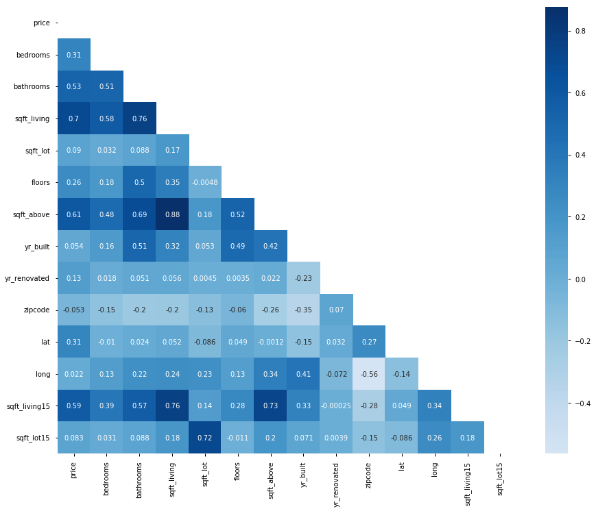
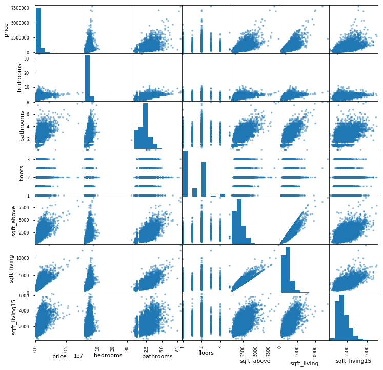
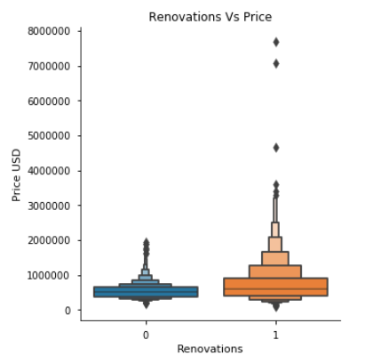
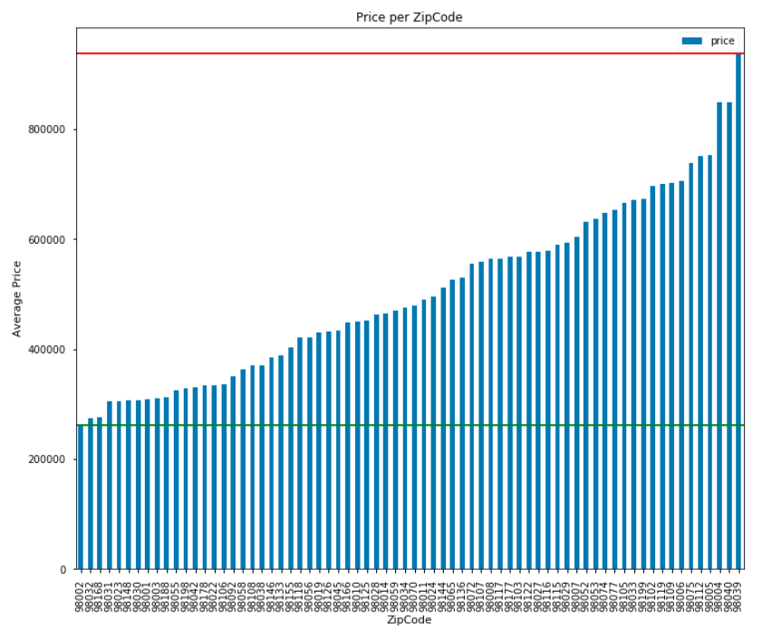
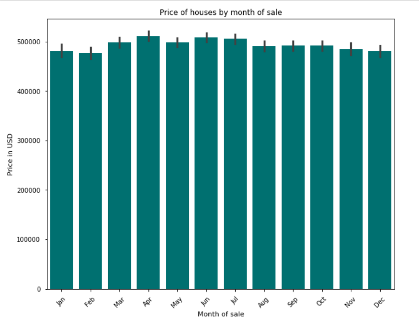
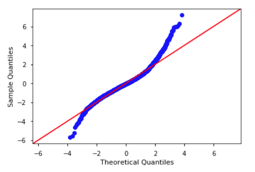
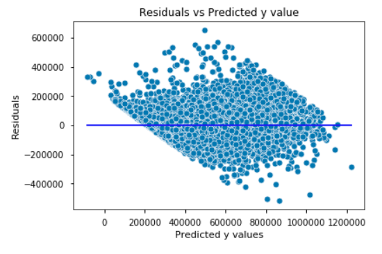
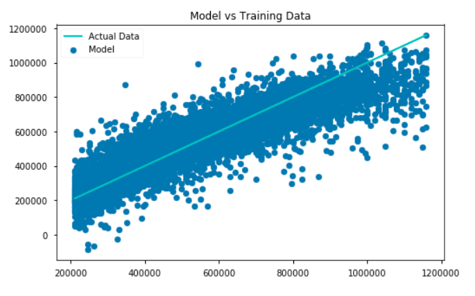

# Phase 2 Project Description

**Author**: Maria Kuzmin

## Business Problem - Don't roam buy a home

The real estate startup “Don’t Roam Buy a Home” (DRBH for short) has contacted us as they are trying to create an app targeted at those who do not feel like they can compete in the current brutal real estate market. DRBH’s application is meant for the normal average person that does not have much knowledge about the real estate market but is trying to understand what would be the best investment given their resources and needs.

In our business case, DRBH has hired us in order to assist with analyzing raw real estate data and breaking down the trends of the housing market in King County. Their end product centers around having users enter the desired number of bedrooms, bathrooms, the overall residence’s square feet or lot size as well as neighborhood, budget in terms of savings and possible monthly mortgage. With this information the app will provide the user key information to help make the most educated choice and have the most profitable investment with the available funds.

Don't Roam Buy a Home will help users answer some questions like: 
- What is the best neighborhood for me to look into buying a house, given my budget?
- What are the most important factors to look at, when evaluating a house and my needs in a house?
- Can I afford an extra bedroom/bathroom or should I save up and add one later on?
- Would it be better to buy a new property or an old run down one and use the extra money to renovate?

These and more are the information that we will be able to provide to the users of the app, starting from our analysis of the King's County Housing Market.


### How are we going to get there

Here is a roadmap of the steps that we are going to take:

* 1 Data Preparation:
        Looking at the Data,
        Cleaning the Data,
        Removing Outliers,
        ,Preparing data: One Hot Encoding
        ,Linear Regression Model with OHE
* 2 Assumptions of Linear Regression:
        Transformations,
        Scaling: Min Max and Normal Scaling,
        Linear Regressions with Scaling,
        Checking for Multicollinearity,
        P-value and F-Statistic,
        Linear Regression Model F-statistic,
* 3 Feature Engineering:
        Renovations,
        Zipcode,
        Seasons,
        Cross Validation,
        Checking for Normality,
        Checking for Homoscedasticity,
        Train Test Split
* 4 Polynomial Regression
        Third Order Polynomials,
        Second Order Polynomials,
        Using Polynomial terms to create new variables
* 5 Recommendations
* 6 Next Steps


### The Data

This project uses the King County House Sales dataset, which can be found in kc_house_data.csv. Here is a brief description of the meaning of each column:

Column Names and Descriptions for King County Data Set
* id - Unique identifier for a house
* date - Date house was sold
* price - Sale price (prediction target)
* bedrooms - Number of bedrooms
* bathrooms - Number of bathrooms
* sqft_living - Square footage of living space in the home
* sqft_lot - Square footage of the lot
* floors - Number of floors (levels) in house
* waterfront - Whether the house is on a waterfront
* view - Quality of view from house
* condition - How good the overall condition of the house is. Related to maintenance of house.
* grade - Overall grade of the house. Related to the construction and design of the house.
* sqft_above - Square footage of house apart from basement
* sqft_basement - Square footage of the basement
* yr_built - Year when house was built
* yr_renovated - Year when house was renovated
* zipcode - ZIP Code used by the United States Postal Service
* lat - Latitude coordinate
* long - Longitude coordinate
* sqft_living15 - The square footage of interior housing living space for the nearest 15 neighbors
* sqft_lot15 - The square footage of the land lots of the nearest 15 neighbors

To get a first sense of what type of correlations the variables have with each other I am going to plot a heatmap and a scatterplot.






## Data preparation:
### Data cleaning
Data cleaning included changing formats, transforming columns, handling missing and NaN values, removing outliers.

Preliminary Linear Regression Model: R squared 0.661
Highest performing coefficients: latitude, grade, bathrooms, condition, floors, sqft_living.

### One hot encoding

One hot encoding of the variables: Number of bedrooms, Number of Bathrooms and Number of Floors.

One Hot Encoding first linear regression model: R squared 0.666

## Assumptions of linear regression:
### Transforming the variables, Normalizing and Scaling them

Log transformation for: sqft_living, sqft_above, sqft_living15.
Scaling done both with MinMax Scaling and Normalization

Both very similar results with the Linear Regression Model: R square 0.661

### Checking for Multicollinearity
Filtered the correlation matrix and selected only values with correlation higher than 0.75: those turned out to be sqft_bove and sqft_living as well as floors1 and floors2.
We expected multicollinearity anyway from the one hot encoding so we subsequently removed one column for each variable that was One Hot Encoded.

### P values, F-Statistic

Beside all the categorical values from one hot encoding, none of the other variables have p>0.05. So we ran another linear regression model dropping a column for each categorical variable, and squarefoot living.

Linear regression model after multicolliearity and F-statistic: R squared 0.66

## Feature Engineering

Feature engineering is about finding new features that we can incorporate in our model and that can improve the way it describes and fits the data.
We are going to look at three features that are already provided (renovations, zipcode and time of sale) but we are going to manipulate them so that they can tell us something more and the information that they carry can be better interpreted by the model.
Then after that we are going to try an unusual way to find other features that can help our model too.

### Renovations 
Let us explore the information that we have about houses that were renovated. 
We created two dataframes, one with houses that were renovated and another one with houses that were not renovated and we filtered it so that the houses on average have the same characteristic of the houses that were renovated (same avg number of bathrooms, bedrooms, sqft living) in order to have two fairly comparable samples.

The results we got:
The houses that have been renovated have on average 3.46 bedrooms, 2.3 bathrooms, 2327 squarefeet of living space. These houses were on average built in 1939 and renovated around 1996 and sold on average for 769 thousand dollars.

For a house that was not renovated, that has on average 3.5 bedrooms, 2.4 bathrooms and 2325 squarefeet of living space, the average selling price is
538 thousand dollars.
So given the same characteristics on average for a house that was renovated and one that wasn't, the house that was renovated got sold for roughly on average $230 thousand more.

We can see the considerable difference also visually in the following graph:



Following one hot encoding, adding the 'renovation' column to the dataframe and running linear regression again: the R squared value obtained was 0.666

### Zipcodes 
Another feature that we might want to consider and include more seriously in our model is the zipcode of the house, since it gives us an indication of the area and also since it does not really make sense to be interpreted as a numerical value, unless it is treated with one hot encoding.

After one hot encoding we ran another linear regression model with this information encoded and obtained an R squared of 0.806

Very relevant increase in the R squared value.
Clearly the zipcode contains some important information and has a lot of influence on the price of the houses.

At this point we did a group-by-zipcode and ran some statistics. It turned out that  the  cheapest zipcode on average has the house price of  262413.0 while the most expansive one is 937857.0

There is a gap of roughly 675 thousand dollars!

We can see this also visually in the following graph:



### Seasons 
Another variable that we can categorize a little bit better is the date. It is probably hard for the model to categorize based on all the different dates of the sales, but maybe there is a trend there that we can explore. Therefore we are going to extract from the sale date the month, and categorize the sales based on their month to see if that also has an influence on the price of the houses.

We found out that the average price of a house sold in the month of February is 477 K while the one for a house sold in foo April is 511 K.



We also did one hot encoding with the information about the month and ran one more linear model: We found an R squared value of 0.804.

### Cross validation:

Running a cross validation test on the dataframe containind all the modifications about we got these results:

train MSRE: 90477.4237704816 
test MSRE: 91539.7559736034
train R2: 0.8062172460203941 
test R2: 0.8008242898610437

As we can see the MSRE is pretty high, but not too bad considering that the unit is in dollars like price, so it means that when we are trying to make a prediction on price of the house we could be off of about $90.000.
On the other hand the R2 results are very good and the test performed almost as well as the train, which tells us that we are not overfitting.

### Checking for Normality:
QQ plot:



This QQ plot shows us that our sample has pretty heavy tails. But at the same time the central part seems to follow a straight line, there isn't strong evidence to think of a non linear relationship but we will verify that later on.

### Checking for homoskedasticity:
Residue Plot:



There seems to be some sort of pattern here, so this would need further studying but overall it is an acceptable result in terms of the distribution of the residues.

### Train Test Split:

Another way that we can run our model is with a train-test split. It's the same logic as the cross validation but instead of repeating it with different splits I do it only one time.
It is less reliable because doing only one split makes the test more subject to randomness, but there are things that we can study with this setting like the mean squared error and root mean squared error.

Train Root Mean Squared Error: 91345.31719765035
Train R squared value: 0.804295603536762
Test Root Mean Squared Error: 88378.10912550481
Test R squared value: 0.8097102215361878
Let us take a look at how our the train sample of our model fits compared to the actual data:



## Polynomial Regression:

Another thing that we can do to improve our model to fit our data is to include higher degree terms, using a polynomial fit. This includes products between the different independent variables, including higher powers of the single variables, up until a power that I can set.

### Third order Polynomial regression

The R-squared value that we obtained from our model including polynomials up until the third grade is 0.764

This is a pretty good R squared, but what usually happens with the polynomial regression is that we are fitting the model on the train set so well, that we are actually overfitting and it will perform very poorly on the test set, because we are picking up not only the actual real trends of the relationship between the variables, but also some random noise, given by the random data.
<br>This is confirma by our train-test split test that gave us an R squared of 0.721 for the train but a NEGATIVE R squared of -0.935 for the test.

The fact that R squared on the test is so bad shows us that we fitted very well the train, in fact too well picking up random noise. This model is not good becayse even if it can explain very well the train it cannot generalize to a randomly chosen test set.

### Second Order Polynomial
What is usually recommended in this situation is to lower the order of the polynomial, which will reduce the number of variables, and overall give us a more simple curve for our model.
Let's see what R squared will look like and if we can avoid the overfitting with a second degree polynomial.

Train R squared: 0.7496610927470541
<br>Test R squared: 0.7226804775485179

This is a pretty good result with polynomial fit, it doesn't give us the usual overfitting, but the R squared it produces is not really high, it is not giving us anything more than what we got with One Hot Encoding.
But there is something else that we can do, for which the Polynomial regression can help us.

### Using Polynomial terms to create new variables 
Usually one thing that is suggested to improve the model is trying to come up with new variables that can increase the correlations, by multiplying some of the independent variables we have.
But it is not necessary to try to multiply them at random, and the polinomial regression even though it usually leads to overfitting, in this case can be very useful.
We are going to run again the model with the polynomial regression, and we are going to look at the factors that performed best (since the polynomial features contain also all the possible interactions between the variables, up until the power that we selected).
Then we are going to take only the terms that performed best, that have a higher coefficient, and make a model again fitting with just those, adding them to our best performing model so far.

best_coefficients='floors^2*long', 'bdrms*yr_reno', 'condition*yr_renovated', 'bdrms*sqft_basement*zipcode', 'yr_built^2*zipcode'

A quick note: these coefficients don't need to make sense from a logical point of view, so we are transitioning from inferential statistic to predictive modeling where we our top priority is not understanding the parameters that determin a change in our target and describe the relationship best, but to have a model that can work as well as possible in predicting the price of a house, even if not all the coefficients are logical.
Now let us create new columns with these features, and we will add them to the DataFrame and run the cross validation model again.

train MSRE: 90466.76806263774 
<br>test MSRE: 91548.80493847934
<br>train R2: 0.8049255714067856 
<br>test R2: 0.7999172610649521

We can see how in this way including only some of the terms generated by the polynomial fit, we still get a high R squared for the train set but we don't get the very low result for the test, R squared is high ALSO for the test which shows that we are not overfitting in this way.

Ultimately what we tried as a new technique helped improving the fit, is generating new features instead of trying randomly some products of variables, using the poly fit to our aid, but avoiding its usual issue of overfitting.

### Predictions on price of the house

With this in depth analysis we were able to create different models, with polynomials and not, that interepret well the results of our data set, with an R squared as high as 80%.
Plugging into these models the information we have from a user about the area where they would like to buy a house, number of bedrooms bathrooms and floors, we should be able to predict the expected price of the house with an error of roughly 90K.
The features that we saw influence more heavily the price are: the area (in terms of zipcode), whether the house was renovated or not, the number of bathrooms, the sqft living area and the time of the year in which the house was sold.
Two other coefficients that we found have a pretty high correlation with price are bathrooms and squarefoot living area.
With these conclusions in mind let us see what concrete recommendations we can give to our users to be able to make the best choice for their dream home, in relation to their budget.

## Recommendations: 

Given everything that we have seen in this study, there are some concrete business recommendations that we can give to the users of "Don't Roam Buy a Home"vto make the best educated choice in purchasing their home:

Scout the areas which have houses in your price range. Depending on the zipcode the average sale price for a house can go from 260 thousand dollars to almost a million.
<br>Save some of your budget for renovations. In particular we recommend buying a house in worse condition but with more squarefootage and then improving it - renovations turned out to be a very important factor in the price of a house, and while adding a bathroom can cost as little as 2500 dollars (link) buying a house with an extra bathroom will increase your price by roughly 50K.
<br>Try to buy during low season, months like December January and February have the lowest average price sales, while in the spring and summer houses tend to sell for more.
<br>Keep an eye on number of bathrooms and squarefootage of the house, as factors that will influence the price of the property.

## Next Steps: 

One factor that turned out to be crucial is the renovations on the house. We could gather more data about that and offer better advice in terms of how much money to keep aside for renovations and what are the type of improvements that would be most beneficial, both for the user and to also increase the resell value of the house.

We could also do a more in depth study about the areas even within the zipcode, to produce targeted statistics and be able to provide an even more precise recommendation in terms of where to look for a house.

With the information we found, we could create and algorythm that takes into account not only the desired house features, but also the user's monthly salary and available cash for down payment. Inputing also the current interest rate and the usual taxes for their state we can determine what would be the closing costs, the monthly mortgage for the user and therefore the possible range of prices of houses that they can afford. If they can't afford the house that they like, we could still help them out. Considering that every month that passes, the user can save up the money that would have gone toward the mortgae to build their savings instead, we can also recommend the user to wait and purchase a house with a bigger down payment (hoping for not too high fluctuations of the market) and in how many months they could afford that house.

## For More Information

Please review my full analysis in [my Jupyter Notebook](./student.ipynb) or my [presentation](./Presentation.pdf).

For any additional questions, please contact **Maria Kuzmin, marianlkuzmin@gmail.com**

## Repository Structure

Description of the structure of the repository and its contents:

```
├── data
    └── column_names.md
    └── kc_house_data.csv
├── Graphs
    └── BarMonths.png
    └── BarZipcode.png
    └── BoxReno.png
    └── Heatmap.png
    └── Homoskedasticity.png
    └── ModelVsData.png
    └── QQplot.png
    └── ScatterBathrooms.png
    └── Scatterplot.png
    └── ScatterSqfeet.png
 ├── student.ipynb   
 ├── CONRTIBUTING.md
 ├── LICENSE.md
 ├── Presentation.pdf
 ├── README.md
 └── untitled
```